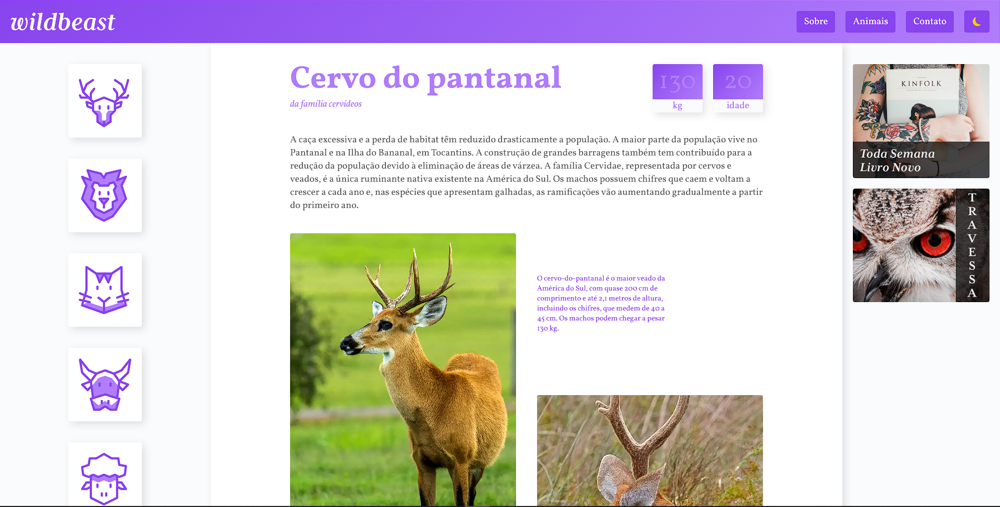

<h1 align="center" >WildBeast - Curso de Grid Layout</h1>

Este é um projeto que deveria ser um projeto simples de grid do curso "CSS Grid Layout" da Origamid, mas resolvi adicionar mais informações e funcionalidades extras com JavaScript.

## </> **Tecnologias usadas**

As principais tecnologias usadas nesse projeto:

- HTML
- CSS
- JavaScript

## 📖 **Descrição do Projeto**

O site fala sobre animais em risco de extinção, problemas ambientais e vários dados sobre eles. É um projeto dado pelo curso de grid da Origamid no qual é ensinado como montar um layout bem estruturado e resposivo com grid. As adições de um modo noturno, header próprio para mobile, troca de conteúdo dos animais sem dar refresh na página com JavaScript puro foram ideias minhas para melhorar o site e para aprender mais JavaScript.

## 🔗 **Links**

- Aqui está o site original - https://www.origamid.com/projetos/wildbeast/
- Github pages - https://gustavogularte.github.io/projeto-wildbeast/
- Meu Twitter - https://twitter.com/gustavoGulArend
- Meu perfil no Front End Mentor com mais desafios - https://www.frontendmentor.io/profile/gustavogularte